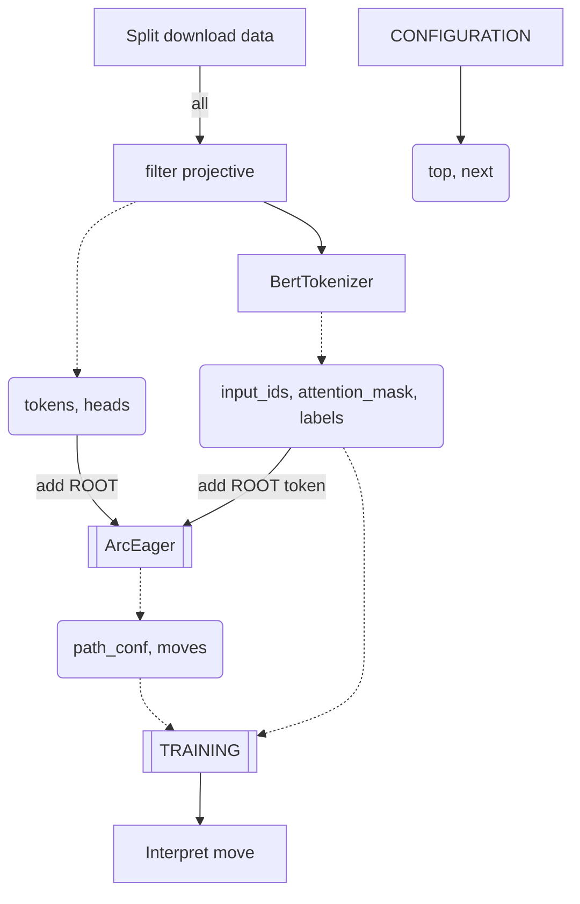

```mermaid
flowchart TD
    D00[Split download data] 
    D01[filter projective]
    D02[[ArcEager]]
    D10[BertTokenizer]

    T00[[TRAINING]]
    T01[Interpret move]

    ND01(tokens, heads)
    ND10(input_ids, attention_mask, labels)
    ND02(path_conf, moves)
    
    D00-->|all| D01
    D01 -.-> ND01
    D01 --> D10
    D10 -.-> ND10 
    ND10 -->|add ROOT token| D02
    ND01 -->|add ROOT|D02
    D02 -.-> ND02

    ND02 -.->T00
    ND10 -.->T00

    T00 --> T01


    Nconf[CONFIGURATION] --> Nsave(top, next)

```
